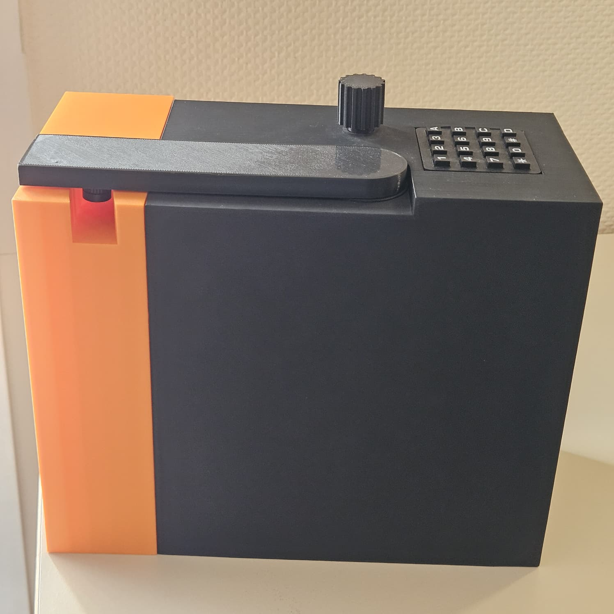

# Read_For_Me

Read_For_Me est un assistant vocal embarqué pensé pour fonctionner sans écran sur Raspberry Pi.
L'utilisateur interagit avec le système via un sélecteur rotatif, un bouton poussoir et un clavier matriciel 4x4.
Selon le mode actif, l'application peut annoncer des informations, lire des mesures ou exécuter une chaîne complète caméra -> OCR -> synthèse vocale.



## Fonctionnalités actuelles

- mode date et heure ;
- mode de test ;
- lecture d'un multimètre OWON via BLE ;
- machine à lire avec caméra Raspberry Pi, OCR Tesseract et lecture audio ;
- lecture d'un pied à coulisse via NRF24 ;
- lecture d'un thermomètre ESP32 via HTTP local ;
- réglage global du volume et de la vitesse via le keypad ;
- configuration centralisée via `config/config.toml`.

## Architecture du projet

Le dépôt est organisé autour de couches simples et extensibles :

- `config/` : chargement et validation de la configuration ;
- `core/` : gestion des modes, registre des modes, synthèse vocale ;
- `hardware/platform/` : matériel branché directement au Raspberry Pi ;
- `hardware/transports/` : transports génériques BLE, HTTP, NRF24 ;
- `hardware/devices/` : drivers de périphériques concrets ;
- `modes/` : fonctionnalités utilisateur ;
- `docs/` : documentation technique écrite et documentation générée.

Le point d'entrée de l'application est `main.py`.

## Modes disponibles

Les modes activés et leur ordre de rotation sont définis dans `config/config.toml`.
Dans la configuration actuelle :

- `datetime`
- `dummy`
- `multimeter`
- `reading_machine`
- `caliper`
- `thermometer`

## Installation

### 1. Cloner le dépôt

```bash
git clone <URL_DU_DEPOT>
cd Read_For_Me
```

### 2. Créer un environnement virtuel

```bash
python -m venv venv
```

Sous Linux :

```bash
source venv/bin/activate
```

Sous Windows PowerShell :

```powershell
.\venv\Scripts\Activate.ps1
```

### 3. Installer les dépendances Python

```bash
pip install -r requirements.txt
```

## Lancement

Pour lancer l'application :

```bash
python main.py
```

## Configuration

La configuration principale se trouve dans `config/config.toml`.
On y règle notamment :

- les broches GPIO ;
- les paramètres du sélecteur rotatif ;
- le layout et les touches globales du keypad ;
- les paramètres BLE du multimètre ;
- la caméra et l'OCR ;
- les timings propres à chaque mode ;
- la liste des modes activés.

## Documentation technique

La documentation rédigée à la main se trouve dans `docs/` :

- [Introduction](./docs/01_introduction/introduction.md)
- [Architecture](./docs/02_architecture/architecture.md)
- [Modules](./docs/03_modules/)
- [Guides de développement](./docs/04_guide_dev/)
- [Annexes](./docs/05_annexes/)

## Génération automatique de la documentation

Le projet peut aussi générer une documentation API à partir des docstrings Python avec Sphinx.

Principe recommandé :

- conserver `docs_sphinx/` en local pour la configuration Sphinx ;
- ne pas forcément versionner ce dossier ;
- déposer les sorties générées dans `docs/generated/`.

### Génération des pages API

```powershell
sphinx-apidoc -o docs_sphinx/source/api . tests docs docs_sphinx models sounds .venv venv
```

### Génération HTML

```powershell
sphinx-build -b html docs_sphinx/source docs/generated/html
```

### Génération Word

```powershell
sphinx-build -b singlehtml docs_sphinx/source docs/generated/singlehtml
pandoc docs/generated/singlehtml/index.html -o docs/generated/word/Read_For_Me.docx
```

### Génération PDF

```powershell
sphinx-build -M latexpdf docs_sphinx/source docs_sphinx/build
```

Sous Windows, la génération PDF via MiKTeX nécessite en pratique :

- MiKTeX à jour ;
- `perl` installé, par exemple via Strawberry Perl.

## Lancement automatique au démarrage

Sur Raspberry Pi, l'application peut être démarrée via un service `systemd`.
Exemple de service :

```ini
[Unit]
Description=Service Read For Me
After=network.target bluetooth.target sound.target

[Service]
Type=simple
User=pi
WorkingDirectory=/home/pi/Read_For_Me
ExecStart=/home/pi/Read_For_Me/venv/bin/python main.py
Restart=on-failure
RestartSec=5

[Install]
WantedBy=multi-user.target
```

## Remarques

- Certains modules dépendent du matériel réel ou de bibliothèques système présentes sur Raspberry Pi.
- La documentation API générée par Sphinx peut utiliser des mocks d'import pour éviter que l'absence de matériel bloque la génération.
- Les fichiers binaires générés (`.pdf`, `.docx`) sont de préférence à ranger dans `docs/generated/`.
